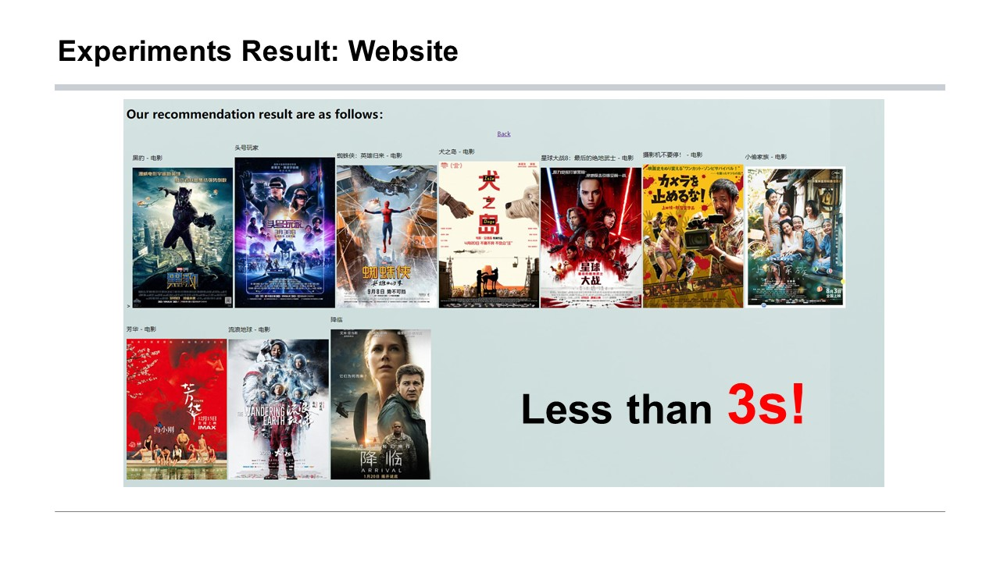

# *One-stop* *Data Mining &* Movie Recommender Platform

NUS Summer Workshop2021 TOP Prize🏆！！

Posters: https://sws.comp.nus.edu.sg/2021/Posters.htm

•    Utilized **XPath**, **Beautiful Soup** to crawl & parse over 4 million user reviews from ‘Douban.’ Built user model.

•    Adopted Item-based collaborative filtering (SVD optimization), Wide & Deep neural networks, and Minimal Marginal Relevance (MMR) algorithms to construct the platform's **Match** layer, **Rank** layer, and **Rerank** layer.

•    Developed both the front-end and back-end of a web-based platform using **Python, Django, and MySQL**.